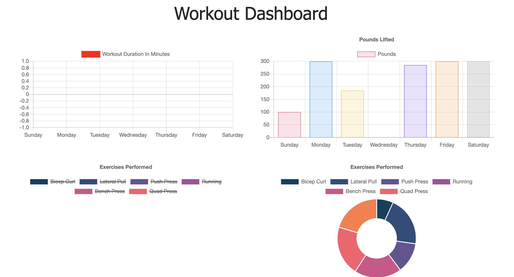
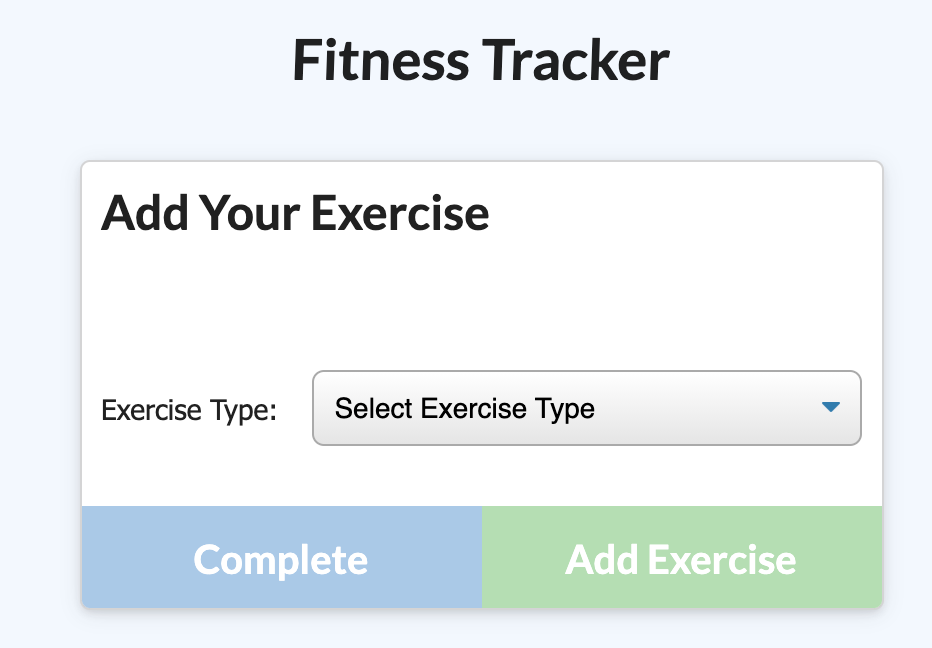

# Fitness Tracker

Deployed App: [Fitness Tracker](https://github.com/amoseman1/fitnessTracker)

## Description

This app allows a user to keep track of workouts or continue an existing workout to stay organized and reach their goals faster.

## Table Of Contents:

-[Installation](#Installation)   -[Usage](#Usage)   -[Liscense](#Liscense)   -[Contributing](#Contributing)   -[Tests](#Tests)   -[Questions](#Questions)

## Installation

npm i - to install dependencies, and npm start - to connect to the server,

## Usage

see the photos below

## Liscense

For more information about the liscense chosen, follow the link below:
[Liscense](https://opensource.org/liscenses/MIT)

## Contributing

Amy Moseman -
NodeJS
Express
MongoDB
Mongoose
Heroku

## Tests

N/A

## Questions

If you have any questions about this repo, open an issue or contact me directly at **amoseman18@gmail.com**.  
You can find more of my work at Github: [amoseman1](https://github.com/amoseman1/)

